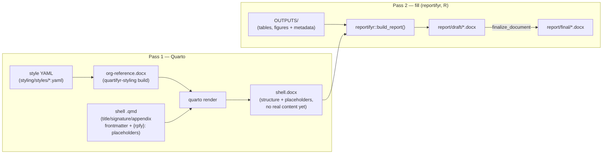

# quartifyr

A code-first system for generating standardized scientific/regulated
documents with [Quarto](https://quarto.org): an org's docx styling and a
document's title/signature/ToC/abbreviations front matter come from YAML
and a `.qmd`, not a hand-edited Word template. A separate pass-2 tool
then fills the rendered shell with real content — today that's
[`reportifyr`](https://github.com/A2-ai/reportifyr) for reports;
presentations, analysis plans, and memos are meant to follow the same
shell/fill split over time — see [Document kinds](#document-kinds)
below.

## Install

quartifyr's shell-generation piece (`_extensions/quartifyr/`) is a
regular Quarto extension, installed the standard way:

```bash
quarto add jprybylski/quartifyr
```

That's the title page, signature pages, synopsis, numbered appendices,
and page header/footer, composed with
[A2-ai's `quarto-plus`](https://github.com/A2-ai/quarto-plus) for ToC/
list of figures/list of tables/abbreviations rather than duplicating
them. The rest of this repo — `styling/` (turns a style YAML into a docx
`reference-doc`) and `r/` (the orchestration driver that runs Quarto then
hands off to a fill tool) — is the surrounding toolkit that pairs with
it; see [Components](#components) below.

## Why

Hand-built Word "shell" templates don't scale across projects or orgs —
every new study means someone re-clicking through Word's style pane, and
drift between shells is a matter of when, not if. The usual alternative,
pharmtex-style LaTeX pipelines, trades that problem for a steep learning
curve most scientific staff don't have, a toolchain that's genuinely prone
to breaking (LaTeX package resolution, font handling, obscure compile
errors), and an output format (PDF) that's harder for non-technical
reviewers to comment on directly than the Word documents they already
know.

quartifyr's answer: generate everything — the org's docx styling, the
shell's title/signature/ToC/abbreviations front matter, appendix
numbering — from code and YAML, output real `.docx` all the way through,
then hand the shell to a fill tool to do what it already does well:
filling it with real tables, figures, and footnotes. That's `reportifyr`
today. No LaTeX. No manual Word template surgery. A new org's look is a
YAML diff; a new project is a `.qmd` with the right frontmatter, not a
Word template someone hand-builds from scratch.

## Architecture: two passes



1. **Pass 1 (Quarto)** renders a styled, structurally-complete shell
   (`.docx`) from a `.qmd`: title page (dynamic per-project fields, plus a
   DRAFT/FINAL status stamp), contributor/approval signature pages, table
   of contents (including the title page), list of figures, list of
   tables, list of abbreviations (only ones actually used), numbered
   appendices — but no actual figures/tables yet, just `reportifyr`
   magic-string placeholders (`{rpfy}:filename.ext`).
2. **Pass 2 (fill)** fills that shell with real tables, figures, and
   footnotes from an `OUTPUTS/` directory, then optionally finalizes it.
   `reportifyr` is today's fill tool for reports, doing this exactly as it
   already does for hand-built shells; presentations are meant to use the
   same shell/fill split, filled by `reportifyr`'s sibling `presentifyr`.

These two passes are independent tools, not a monolith. `reportifyr`
doesn't know or care that a shell's `{rpfy}:` magic strings came from a
quartifyr render rather than a hand-built one; `quarto render` doesn't
know or care what happens to its docx afterward. `r/`'s `render_report()`
(see [`r/README.md`](r/README.md)) is one convenience wrapper that chains
both passes together and adopts a specific `report/shell` →
`report/draft`/`report/final` directory convention (via
`reportifyr::make_doc_dirs()`); it's optional. See
[Using the pieces directly](#using-the-pieces-directly) below for the
three plain tool calls underneath it.

## Using the pieces directly

You don't need this repo's `r/` orchestration driver, its `rv`-managed R
environment, or its `report/shell`/`report/draft`/`report/final`
directory convention to use quartifyr — that's all just what
`render_report()` happens to do. If you already have your own Quarto
project and your own `reportifyr` project set up, the underlying
mechanics are three ordinary, independent tool calls:

```bash
# 1. Render the shell -- ordinary `quarto render`; quartifyr is just a
#    Quarto extension plus a reference-doc, nothing project-structure-
#    specific about how you invoke it.
quarto render report.qmd --to docx --reference-doc org-reference.docx \
  -M document-status:DRAFT

# 2. (Optional) header/footer + page-restart post-processing. Skip this
#    and you still get a basic footer straight from step 1 -- whatever
#    the reference-doc itself was built with (by default: a continuous
#    page number, no restart) -- but header-format:/confidentiality:/
#     in the .qmd have no effect without this step;
#    see _extensions/quartifyr/README.md's "Page header/footer and page
#    numbering" section for exactly what each piece needs.
quartifyr-styling apply-layout --docx report.docx --qmd report.qmd --status draft
```

```r
# 3. Fill it -- ordinary reportifyr, called exactly as you'd call it
# against a hand-built shell. quartifyr's {rpfy}: placeholders ARE
# reportifyr's own mechanism; there's nothing quartifyr-specific for
# reportifyr to know about.
reportifyr::build_report(
  docx_in = "report.docx",
  docx_out = "report-filled.docx",
  figures_path = "OUTPUTS/figures",
  tables_path = "OUTPUTS/tables",
  standard_footnotes_yaml = "report/standard_footnotes.yaml",
  config_yaml = "report/config.yaml"
)
```

`docx_in`/`docx_out` are plain paths — no `report/shell/`-style directory
naming required; that convention only exists because `render_report()`
happens to use `reportifyr::make_doc_dirs()` to derive them. An existing
reportifyr project's own layout and scripts work unchanged; quartifyr
only touches the docx that flows between steps 1 and 3, not how or where
you call them from.

`render_report()` bundles these three calls into one because that's
convenient for a project starting from scratch (and for
[`examples/demo-report/`](examples/demo-report/README.md)) — it's a
convenience, not a requirement.

## Components

| Path | What it is |
| --- | --- |
| [`styling/`](styling/README.md) | Python package: turns a style YAML (fonts, colors, page setup) into a docx `reference-doc`; the `standard_footnotes.yaml` → `abbreviations.tex` bridge; headless Word field recalculation via LibreOffice (experimental). `uv`-managed venv. |
| [`_extensions/quartifyr/`](_extensions/quartifyr/README.md) | Quarto extension: dynamic title page + status stamp, contributor/approver signature pages, synopsis, numbered appendices, page header/footer with roman/arabic page numbering. Composes with [A2-ai's `quarto-plus`](https://github.com/A2-ai/quarto-plus) (ToC/List of Figures/List of Tables/abbreviations/captions) rather than duplicating it. |
| [`r/`](r/README.md) | `rv`-managed R environment providing `render_report()`, the pass-1+pass-2 orchestration driver. Pulls `reportifyr` and `pyro` straight from GitHub (no CRAN release exists for either) as today's fill backend. |
| [`examples/demo-report/`](examples/demo-report/README.md) | Complete, working example exercising every piece above, with an automated end-to-end smoke test — a reference to compare against, not the only way to start a project (see [Standing up a new project](#standing-up-a-new-project)). |

Each org overrides just the parts of the default look that differ
(`styling/styles/default.yaml` is Times New Roman, black text, flat
neutral tables — no brand color baked in) as a small YAML diff, not a
round of clicking through Word's style pane.

## Quick start

Requires, once each (platform-specific instructions at each link):

- [Quarto](https://quarto.org/docs/get-started/)
- [uv](https://docs.astral.sh/uv/getting-started/installation/) (Python tooling)
- [rv](https://a2-ai.github.io/rv-docs/) (R package management)

```bash
# 1. Python tooling
uv venv .venv --python 3.12
source .venv/bin/activate
uv pip install -e "./styling[dev]"

# 2. Org docx styling
quartifyr-styling build --style styling/styles/default.yaml --out templates/org-reference.docx

# 3. R tooling
cd r && rv sync && cd ..

# 4. Run the demo end to end
cd examples/demo-report
rv sync
Rscript -e 'reportifyr::initialize_report_project(project_dir = getwd())'   # first clone only
Rscript render.R --final
# -> report/draft/report-draft.docx, report/final/report-final.docx
```

Or just run the demo's own smoke test, which does step 4 for you and
asserts the output is actually correct: `python3
examples/demo-report/smoke_test.py`.

## Standing up a new org

An org's look lives entirely in one YAML file — no Word template editing.

```bash
cp styling/styles/default.yaml styling/styles/acme-pharma.yaml
# edit fonts/colors/page setup/table.header_bold/etc.
quartifyr-styling build \
  --style styling/styles/default.yaml \
  --override styling/styles/acme-pharma.yaml \
  --out templates/acme-pharma-reference.docx
```

See `styling/styles/default.yaml` for the full schema and
`styling/quartifyr_styling/schema.py` for validation rules.

## Style YAML and reference-doc: generating, locating, sharing

**Generating a style YAML**: there's no interactive wizard — "generate"
means copy `styling/styles/default.yaml` and edit just the fields that
differ, as shown above. That file doubles as both the default preset
and the schema reference; `styling/quartifyr_styling/schema.py`
documents validation rules (hex colors, positive sizes, valid page
sizes, ...).

**Where a style YAML lives**: `styling/styles/*.yaml` is just this
repo's own convention for keeping org styles alongside the tool that
builds them — nothing requires it. `--style`/`--override` take plain
file paths, so an org can keep its style YAML(s) anywhere: a separate
internal config repo, a shared drive, wherever it already manages
shared config.

**Where the built reference-doc lives**: likewise, wherever `--out`
points. `templates/org-reference.docx` (relative to this checkout) is
what this repo's own docs default to because `render_report()`'s
`reference_doc` parameter defaults to `file.path(toolkit_root,
"templates", "org-reference.docx")`, and `toolkit_root` itself defaults
to `here::here()`. For `examples/demo-report/`, that resolves correctly
only because its own `render.R` computes `toolkit_root` explicitly, as
a relative path back up to this repo's root (it doesn't rely on the
`here::here()` default at all — see its source). **A genuinely
independent project (its own git repo, not nested inside a quartifyr
checkout) can't rely on that default** — `here::here()` would resolve
to the new project's own root instead of quartifyr's. Pass
`reference_doc` explicitly instead (and `venv_bin` too, unless the
`styling/` venv's `bin/` is already on `PATH`):

```r
render_report(
  shell_qmd = "report.qmd",
  status = "draft",
  reference_doc = "/path/to/org-reference.docx",
  venv_bin = "/path/to/quartifyr/.venv/bin"
)
```

**Sharing a reference-doc so most users never run `quartifyr-styling
build`**: only whoever owns an org's styling needs to run `build` at
all. Once built, `templates/org-reference.docx` is an ordinary `.docx`
file — distribute *that* however your org already shares binary
artifacts (commit a copy into each project's own repo under its own
`templates/`, a shared drive, an internal artifact store, ...), and
point each project's `reference_doc` at wherever it landed. Committing
a copy into each project is the simplest option for a standalone
project: it makes the project fully self-contained (no need to locate
or even keep a quartifyr checkout around just to render) at the cost of
re-copying the file whenever the org's styling changes.

## Standing up a new project

This is the full `render_report()` path — the convenience wrapper from
[Using the pieces directly](#using-the-pieces-directly) above. If you
already have a Quarto project and a `reportifyr` project, steps 2 and 4
below are specific to `render_report()`'s own conventions and can be
skipped; call `quarto render`, `quartifyr-styling apply-layout`, and
`reportifyr::build_report()` yourself against your existing layout
instead.

A project set up the `render_report()` way needs:

1. **The extensions**, physically copied (not symlinked — Quarto's
   extension loader doesn't follow symlinks) into `_extensions/` at the
   project root, alongside the shell `.qmd`:
   ```bash
   quarto add A2-ai/quarto-plus
   quarto add jprybylski/quartifyr
   ```
2. **`_quarto.yml`** setting `project: {output-dir: report/shell}` — this
   is only needed for `render_report()`'s own directory convention: it's
   what redirects the rendered docx into `report/shell/`, where
   `reportifyr::make_doc_dirs()` (called by `render_report()`) expects to
   find it. Skip this if you're calling `quarto render` yourself with an
   explicit `--output` path.
3. **A shell `.qmd`** at the project root with `filters: [quarto-plus,
   quartifyr]` and `toc-style-map: [{style: Title, level: 1}]`, plus
   frontmatter for whichever front-matter pieces you want (`title`,
   `contributors`/`approvers`, `synopsis`, `header-format`, ...) — see
   [`_extensions/quartifyr/README.md`](_extensions/quartifyr/README.md)
   for the full list, and use ``/`{rpfy}:` placeholders/
   `quarto-plus`'s caption shortcodes in the body as needed.
4. **`reportifyr`'s own project structure** (`report/standard_footnotes.yaml`,
   `report/config.yaml`, `OUTPUTS/`):
   ```bash
   Rscript -e 'reportifyr::initialize_report_project(project_dir = getwd())'
   ```
5. **A docx reference-template** — reuse an existing org one, or build a
   new one (see [Standing up a new org](#standing-up-a-new-org) above).
   If this project isn't nested inside a quartifyr checkout, pass
   `reference_doc` (and likely `venv_bin`) explicitly to `render_report()`
   — see [Style YAML and reference-doc](#style-yaml-and-reference-doc-generating-locating-sharing)
   above for why the defaults don't apply there.

Then write your own `scripts/`, producing `OUTPUTS/tables/`/
`OUTPUTS/figures/` artifacts via `reportifyr`'s
`write_csv_with_metadata()`/`ggsave_with_metadata()` wrappers, and render
with `Rscript render.R` (add `--final` once ready to finalize).

[`examples/demo-report/`](examples/demo-report/README.md) has all of the
above wired together and working end to end — a reference to check your
own setup against, not a starting point you're expected to fork.

## Document kinds

The shell/fill split generalizes across whatever document kinds a
scientific/regulated team standardizes on, not just reports:

- **Reports** (the current focus, filled by `reportifyr`)
- **Presentations** — filled by `reportifyr`'s sibling `presentifyr`
  (same "fyr" ecosystem as `reportifyr` and `pyro`)
- **Analysis plans**
- **Memos**

The pieces already built stay document-kind-agnostic where that costs
nothing (the style YAML schema, the docx template generator);
document-kind-specific pieces (title/signature pages, appendix numbering)
live in the Quarto extension and get added as needed rather than
speculatively.

## Status and known limitations

The core pipeline — styling, title/signature pages, ToC/LOF/LOT,
abbreviations, appendices, and the `reportifyr` fill pass — is built and
verified end to end (see `examples/demo-report/smoke_test.py`, which runs
the real pipeline and checks the actual output on every run). Two things
are deliberately incomplete rather than papered over:

- **Word field recalculation** (`quartifyr-styling recalculate-fields`,
  headless LibreOffice) is experimental — it works, but has shown
  non-deterministic failure modes in real testing. See
  [`r/README.md`](r/README.md#word-field-recalculation-optional-off-by-default).
  Off by default; without it, delivered docs need one manual "select all,
  F9" in Word to populate the ToC.
- **Figure/table numbering stays continuous through appendices** (e.g.
  "Figure 12" inside an appendix, not "Figure B-1") — a deliberate v1
  scope call, not a bug. See
  [`_extensions/quartifyr/README.md`](_extensions/quartifyr/README.md#appendices).

## vs. pharmtex

| | pharmtex (LaTeX) | quartifyr |
| --- | --- | --- |
| Toolchain | Full LaTeX distribution + custom packages | Quarto + R + Python, all mainstream, cross-platform installers |
| Org styling | LaTeX template files, org-specific macros | One YAML file per org |
| Failure mode | Obscure LaTeX compile errors, package resolution | Ordinary Quarto/R/Python errors with normal stack traces |
| Output format | PDF | `.docx` — reviewers use Word's own track-changes/comments |
| Learning curve | Steep (LaTeX syntax, package ecosystem) | A `.qmd` is Markdown + YAML frontmatter |
| Report fill | Custom | `reportifyr` today — pass-2 is a pluggable fill step, not fixed to it |
