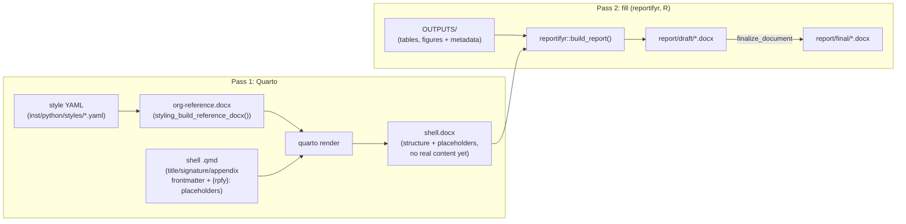

# quartifyr 

A code-first system for generating standardized scientific/regulated
documents with [Quarto](https://quarto.org): an org's docx styling and a
document's title/signature/ToC/abbreviations front matter come from YAML
and a `.qmd`, not a hand-edited Word template. A separate pass-2 tool
then fills the rendered shell with real content: today that's
[`reportifyr`](https://github.com/A2-ai/reportifyr) for reports, with
presentations, analysis plans, and memos meant to follow the same
shell/fill split over time (see [Document kinds](#document-kinds)
below).

## Install

quartifyr is an installable R package:

```r
pak::pak("jprybylski/quartifyr")   # or remotes::install_github("jprybylski/quartifyr")
```

`quartifyr::render_report()` is the orchestration driver: it chains a
`quarto render` against a docx `reference-doc` it can build for you
(`quartifyr::styling_build_reference_docx()`, a thin `pyro`-bridged
wrapper around a bundled Python engine -- see
[Components](#components)) with a fill tool (`reportifyr` today) in one
call.

The shell-generation piece is also a regular Quarto extension bundled
inside the package (`inst/extensions/quartifyr/`) -- install it into a
project with `quartifyr::install_quartifyr_extension()`, or the standard
Quarto way if you'd rather not depend on the R package for this piece
alone:

```bash
quarto add jprybylski/quartifyr
```

That's the title page, signature pages, synopsis, numbered appendices,
and page header/footer, composed with
[A2-ai's `quarto-plus`](https://github.com/A2-ai/quarto-plus) for ToC/
list of figures/list of tables/abbreviations rather than duplicating
them.

## Why

Hand-built Word "shell" templates don't scale across projects or orgs:
every new study means someone re-clicking through Word's style pane, and
drift between shells is a matter of when, not if. The usual alternative,
pharmtex-style LaTeX pipelines, trades that problem for a steep learning
curve most scientific staff don't have, a toolchain that's prone
to breaking (LaTeX package resolution, font handling, obscure compile
errors), and an output format (PDF) that's harder for non-technical
reviewers to comment on directly than the Word documents they already
know.

quartifyr's answer: generate everything (the org's docx styling, the
shell's title/signature/ToC/abbreviations front matter, appendix
numbering) from code and YAML, output real `.docx` all the way through,
then hand the shell to a fill tool to do what it already does well:
filling it with real tables, figures, and footnotes. That's `reportifyr`
today. No LaTeX. No manual Word template surgery. A new org's look is a
YAML diff; a new project is a `.qmd` with the right frontmatter, not a
Word template someone hand-builds from scratch.

## Architecture: two passes



1. **Pass 1 (Quarto)** renders a styled, structurally-complete shell
   (`.docx`) from a `.qmd`: title page (dynamic per-project fields, plus a
   DRAFT/FINAL status stamp), contributor/approval signature pages, table
   of contents (including the title page), list of figures, list of
   tables, list of abbreviations (only ones actually used), numbered
   appendices, but no actual figures/tables yet, just `reportifyr`
   magic-string placeholders (`{rpfy}:filename.ext`).
2. **Pass 2 (fill)** fills that shell with real tables, figures, and
   footnotes from an `OUTPUTS/` directory, then optionally finalizes it.
   `reportifyr` is today's fill tool for reports, doing this exactly as it
   already does for hand-built shells; presentations are meant to use the
   same shell/fill split, filled by `reportifyr`'s sibling `presentifyr`.

These two passes are independent tools, not a monolith. `reportifyr`
doesn't know or care that a shell's `{rpfy}:` magic strings came from a
quartifyr render rather than a hand-built one; `quarto render` doesn't
know or care what happens to its docx afterward. `quartifyr::
render_report()` is one convenience wrapper that chains both passes
together and adopts a specific `report/shell` →
`report/draft`/`report/final` directory convention (via
`reportifyr::make_doc_dirs()`); it's optional. See
[Using the pieces directly](#using-the-pieces-directly) below for the
three plain tool calls underneath it.

## Using the pieces directly

You don't need the `quartifyr` R package's orchestration driver or its
`report/shell`/`report/draft`/`report/final` directory convention to use
quartifyr; that's all just what `render_report()` happens to do. If you
already have your own Quarto project and your own `reportifyr` project
set up, the underlying mechanics are three ordinary, independent tool
calls:

```bash
# 1. Render the shell -- ordinary `quarto render`; quartifyr is just a
#    Quarto extension plus a reference-doc, nothing project-structure-
#    specific about how you invoke it.
quarto render report.qmd --to docx --reference-doc org-reference.docx \
  -M document-status:DRAFT

# 2. (Optional) header/footer + page-restart post-processing. Skip this
#    and you still get a basic footer straight from step 1 -- whatever
#    the reference-doc itself was built with (by default: a continuous
#    page number, no restart) -- but header-format:/confidentiality:/
#    crossref-hyperlinks:/ in the .qmd have no effect
#    without this step; see inst/extensions/quartifyr/README.md's "Page
#    header/footer and page numbering" and "Figures, tables, and
#    cross-references" sections for exactly what each piece needs.
#    quartifyr-styling is the standalone CLI (uv tool install / pip
#    install the quartifyr-styling package); from R, use
#    quartifyr::styling_apply_layout() instead -- same underlying engine.
quartifyr-styling apply-layout --docx report.docx --qmd report.qmd --status draft
```

```r
# 3. Fill it -- ordinary reportifyr, called exactly as you'd call it
# against a hand-built shell. quartifyr's {rpfy}: placeholders ARE
# reportifyr's own mechanism; there's nothing quartifyr-specific for
# reportifyr to know about.
reportifyr::build_report(
  docx_in = "report.docx",
  docx_out = "report-filled.docx",
  figures_path = "OUTPUTS/figures",
  tables_path = "OUTPUTS/tables",
  standard_footnotes_yaml = "report/standard_footnotes.yaml",
  config_yaml = "report/config.yaml"
)
```

`docx_in`/`docx_out` are plain paths, no `report/shell/`-style directory
naming required; that convention only exists because `render_report()`
happens to use `reportifyr::make_doc_dirs()` to derive them. An existing
reportifyr project's own layout and scripts work unchanged; quartifyr
only touches the docx that flows between steps 1 and 3, not how or where
you call them from.

`render_report()` bundles these three calls into one because that's
convenient for a project starting from scratch (and for
[`examples/demo-report/`](examples/demo-report/README.md)); it's a
convenience, not a requirement.

If `crossref-hyperlinks: "same-page"` is set, one more optional step goes
after step 3, on the *filled* docx: `quartifyr::
styling_resolve_same_page_crossrefs("report-filled.docx")` (or the CLI
equivalent, `quartifyr-styling resolve-same-page-crossrefs`); see
[`inst/python/README.md`](inst/python/README.md) for the underlying
Python engine.

## Components

| Path | What it is |
| --- | --- |
| `R/`, `DESCRIPTION`, `NAMESPACE` | The installable `quartifyr` R package itself: `render_report()` (the pass-1+pass-2 orchestration driver), `initialize_quartifyr_project()`, `install_quartifyr_extension()`, and thin `pyro`-bridged `styling_*()` wrappers around the bundled Python engine. Pulls `reportifyr` and `pyro` straight from `a2-ai.r-universe.dev` (no CRAN release exists for either) as today's fill backend. |
| [`inst/python/`](inst/python/README.md) | The bundled Python engine (`quartifyr_styling`): turns a style YAML (fonts, colors, page setup) into a docx `reference-doc`; the `standard_footnotes.yaml` → `abbreviations.tex` bridge; headless Word field recalculation via LibreOffice (experimental). Also independently pip/uv-installable (`quartifyr-styling` console script) -- see the repo-root `pyproject.toml`, which points at this same source tree. |
| [`inst/extensions/quartifyr/`](inst/extensions/quartifyr/README.md) | Quarto extension, bundled in the R package and installable via `install_quartifyr_extension()` or `quarto add jprybylski/quartifyr`: dynamic title page + status stamp, a fax-cover-sheet-style memo cover page, contributor/approver signature pages, synopsis, numbered appendices, page header/footer with roman/arabic page numbering. Composes with [A2-ai's `quarto-plus`](https://github.com/A2-ai/quarto-plus) (ToC/List of Figures/List of Tables/abbreviations/captions) rather than duplicating it. |
| [`examples/demo-report/`](examples/demo-report/README.md) | Complete, working example exercising every piece above, with an automated end-to-end smoke test: a reference to compare against, not the only way to start a project (see [Standing up a new project](#standing-up-a-new-project)). |
| [`examples/memo-example/`](examples/memo-example/README.md) | The minimal end of the same pipeline: a memo cover page and a loose structure with no ToC/List of Figures/List of Tables/abbreviations/signature pages, also with its own smoke test. |
| [`action.yml`](action.yml) | Reusable composite GitHub Action wrapping `render_report()` for use in another repo's own CI; see [Rendering in CI](#rendering-in-ci) below. |

Each org overrides just the parts of the default look that differ
(`inst/python/styles/default.yaml` is Times New Roman, black text, flat
neutral tables, no brand color baked in) as a small YAML diff, not a
round of clicking through Word's style pane.

## Quick start

Want to see the shell before installing anything but Quarto? Both bundled
examples ship a pre-built `inst/templates/org-reference.docx` (committed
to the repo; see [Style YAML and reference-doc](#style-yaml-and-reference-doc-generating-locating-sharing)
below), so this alone renders a real, styled shell (title page,
signature pages, synopsis) with `{rpfy}:` placeholders still literal
(pass 2 hasn't run):

```bash
cd examples/demo-report
quarto render report.qmd --to docx --reference-doc ../../inst/templates/org-reference.docx \
  -M document-status:DRAFT
```

`scripts/quarto_only_smoke_test.py` runs exactly this for both examples
and asserts on the output; it's the first CI check to run, before any R
or Python setup, as proof this path has no dependency on either.

For the full two-pass pipeline (real tables/figures/footnotes filled in,
not just the shell), you need the rest of the toolchain, once each
(platform-specific instructions at each link):

- [Quarto](https://quarto.org/docs/get-started/)
- [uv](https://docs.astral.sh/uv/getting-started/installation/) (Python tooling, used internally by `pyro`)
- [renv](https://rstudio.github.io/renv/) (R package management for report *projects*; `install.packages("renv")`. The `quartifyr` R package itself isn't renv-managed -- see [Components](#components).)

```bash
# 1. Install the quartifyr R package itself (pulls in reportifyr/pyro
#    transitively via its DESCRIPTION Imports:)
Rscript -e 'pak::pkg_install("local::.")'   # from this checkout's root

# 2. Run the demo end to end
cd examples/demo-report
Rscript -e 'renv::restore()'
Rscript -e 'renv::install("local::../..")'   # installs quartifyr into this project's own renv library
Rscript -e 'reportifyr::initialize_report_project(project_dir = getwd())'   # first clone only
Rscript -e 'quartifyr::initialize_quartifyr_project(getwd())'              # first clone only
Rscript render.R --final
# -> report/draft/report-draft.docx, report/final/report-final.docx
```

Or just run the demo's own smoke test, which does step 3 for you and
asserts the output is actually correct: `python3
examples/demo-report/smoke_test.py`.

[`examples/memo-example/`](examples/memo-example/README.md) works the
same way (`cd examples/memo-example` instead of `examples/demo-report`)
and demonstrates the other end of the same pipeline: a memo cover page
instead of a report title page, with no ToC/List of Figures/List of
Tables/abbreviations/signature pages.

## Standing up a new org

An org's look lives entirely in one YAML file, no Word template editing.

```r
default_style <- system.file("python", "styles", "default.yaml", package = "quartifyr")
file.copy(default_style, "acme-pharma.yaml")
# edit fonts/colors/page setup/table.header_bold/etc.
quartifyr::styling_build_reference_docx(
  style = default_style,
  override = "acme-pharma.yaml",
  out = "acme-pharma-reference.docx"
)
```

Or the equivalent standalone CLI, if you'd rather not go through R:

```bash
quartifyr-styling build \
  --style /path/to/inst/python/styles/default.yaml \
  --override acme-pharma.yaml \
  --out acme-pharma-reference.docx
```

See `inst/python/styles/default.yaml` for the full schema and
`inst/python/quartifyr_styling/schema.py` for validation rules.

## Style YAML and reference-doc: generating, locating, sharing

**Generating a style YAML**: there's no interactive wizard. "Generate"
means copy the bundled `default.yaml` and edit just the fields that
differ, as shown above. That file doubles as both the default preset
and the schema reference; `inst/python/quartifyr_styling/schema.py`
documents validation rules (hex colors, positive sizes, valid page
sizes, ...).

**Where a style YAML lives**: wherever you put it. `style`/`override`
(`styling_build_reference_docx()`) or `--style`/`--override`
(`quartifyr-styling build`) take plain file paths, so an org can keep
its style YAML(s) anywhere: a separate internal config repo, a shared
drive, wherever it already manages shared config.

**Where the built reference-doc lives**: likewise, wherever `out`/
`--out` points. `render_report()`'s `reference_doc` parameter defaults
to the package's own bundled `inst/templates/org-reference.docx` (via
`system.file("templates", "org-reference.docx", package = "quartifyr")`)
-- unlike everything else `styling_build_reference_docx()`/
`quartifyr-styling build` produces, this repo commits that specific
file rather than gitignoring it, precisely so the two bundled examples
(and the Quarto-only path above) work straight out of a clone with no
build step required. `scripts/check_template_freshness.py` (run by both
examples' `smoke_test.py`, and safe to run yourself) guards against it
drifting from `inst/python/styles/default.yaml`; rebuild it (`python3
scripts/check_template_freshness.py`) after changing that file.

For your own org's reference-doc, pass `reference_doc` explicitly rather
than relying on the bundled default:

```r
render_report(
  shell_qmd = "report.qmd",
  status = "draft",
  reference_doc = "/path/to/acme-pharma-reference.docx"
)
```

**Sharing a reference-doc so most users never call
`styling_build_reference_docx()`**: only whoever owns an org's styling
needs to build one at all. Once built, it's an ordinary `.docx` file,
distribute *that* however your org already shares binary artifacts
(commit a copy into each project's own repo, a shared drive, an internal
artifact store, ...), and point each project's `reference_doc` at
wherever it landed. Committing a copy into each project is the simplest
option for a standalone project: it makes the project fully
self-contained (no need to rebuild it just to render) at the cost of
re-copying the file whenever the org's styling changes.

## Standing up a new project

This is the full `render_report()` path: the convenience wrapper from
[Using the pieces directly](#using-the-pieces-directly) above. If you
already have a Quarto project and a `reportifyr` project, steps 2 and 4
below are specific to `render_report()`'s own conventions and can be
skipped; call `quarto render`, `quartifyr-styling apply-layout`, and
`reportifyr::build_report()` yourself against your existing layout
instead.

A project set up the `render_report()` way needs:

1. **The extensions**, physically copied (not symlinked; Quarto's
   extension loader doesn't follow symlinks) into `_extensions/` at the
   project root, alongside the shell `.qmd`:
   ```bash
   quarto add A2-ai/quarto-plus
   ```
   ```r
   quartifyr::install_quartifyr_extension()   # or: quarto add jprybylski/quartifyr
   ```
2. **`_quarto.yml`** setting `project: {output-dir: report/shell}`. This
   is only needed for `render_report()`'s own directory convention: it's
   what redirects the rendered docx into `report/shell/`, where
   `reportifyr::make_doc_dirs()` (called by `render_report()`) expects to
   find it. Skip this if you're calling `quarto render` yourself with an
   explicit `--output` path.
3. **A shell `.qmd`** at the project root with `filters: [quarto-plus,
   quartifyr]`, plus frontmatter for whichever front-matter pieces you want (`title`,
   `contributors`/`approvers`, `synopsis`, `header-format`, ...); see
   [`inst/extensions/quartifyr/README.md`](inst/extensions/quartifyr/README.md)
   for the full list, and use ``/`{rpfy}:` placeholders/
   `quarto-plus`'s caption shortcodes in the body as needed.
4. **`reportifyr`'s own project structure** (`report/standard_footnotes.yaml`,
   `report/config.yaml`, `OUTPUTS/`), plus `quartifyr`'s own pyro-managed
   Python environment:
   ```r
   reportifyr::initialize_report_project(project_dir = getwd())
   quartifyr::initialize_quartifyr_project(getwd())
   ```
5. **A docx reference-template**: reuse an existing org one, or build a
   new one (see [Standing up a new org](#standing-up-a-new-org) above).
   Pass `reference_doc` explicitly to `render_report()` unless the
   bundled default is what you want; see
   [Style YAML and reference-doc](#style-yaml-and-reference-doc-generating-locating-sharing)
   above.

Then write your own `scripts/`, producing `OUTPUTS/tables/`/
`OUTPUTS/figures/` artifacts via `reportifyr`'s
`write_csv_with_metadata()`/`ggsave_with_metadata()` wrappers, and render
with `Rscript render.R` (add `--final` once ready to finalize).

[`examples/demo-report/`](examples/demo-report/README.md) has all of the
above wired together and working end to end: a reference to check your
own setup against, not a starting point you're expected to fork.

## Rendering in CI

Once a project is stood up the way above, `action.yml` at this repo's
root is a reusable [GitHub
Action](https://docs.github.com/en/actions/creating-actions/creating-a-composite-action)
wrapping the same `render_report()` pipeline, so another repo's own
workflow can render its report and upload the result as a build artifact
without hand-rolling the Quarto/R/`reportifyr` setup steps:

```yaml
- uses: jprybylski/quartifyr@v1
  id: render
  with:
    shell-qmd: report.qmd
    final: 'true'

- uses: actions/upload-artifact@v4
  with:
    name: report
    path: ${{ steps.render.outputs.draft-docx }}
```

See [the docs site's GitHub Action page](https://jprybylski.github.io/quartifyr/articles/github-action.html)
for the full input/output list and what it expects from the calling repo.

## Document kinds

The shell/fill split generalizes across whatever document kinds a
scientific/regulated team standardizes on, not just reports:

- **Reports** (the current focus, filled by `reportifyr`)
- **Presentations**: filled by `reportifyr`'s sibling `presentifyr`
  (same "fyr" ecosystem as `reportifyr` and `pyro`)
- **Analysis plans**
- **Memos**

The pieces already built stay document-kind-agnostic where that costs
nothing (the style YAML schema, the docx template generator);
document-kind-specific pieces (title/signature pages, appendix numbering)
live in the Quarto extension and get added as needed rather than
speculatively.

## Status and known limitations

The core pipeline (styling, title/signature pages, ToC/LOF/LOT,
abbreviations, appendices, bibliography/citations, and the `reportifyr`
fill pass) is built and verified end to end (see
`examples/demo-report/smoke_test.py`, which runs the real pipeline and
checks the actual output on every run). Two things are deliberately
incomplete rather than papered over:

- **Word field recalculation** (`styling_recalculate_fields()` /
  `quartifyr-styling recalculate-fields`, headless LibreOffice) is
  experimental: it works, but has shown non-deterministic failure modes
  in real testing (hangs, silent no-ops, or success, reproduced both
  sandboxed and in a plain terminal). Off by default
  (`render_report(..., recalculate_fields = FALSE)`); without it,
  delivered docs need one manual "select all, F9" in Word to populate the
  ToC. Real Word itself needs none of this -- the reference-doc sets
  `<w:updateFields>` so Word auto-recalculates on open regardless; this
  only matters for headless/non-interactive pipelines. Same reasoning and
  the same underlying headless-LibreOffice mechanism apply to
  `styling_resolve_same_page_crossrefs()` (for `crossref-hyperlinks:
  "same-page"`), also off by default.
- **Figure/table numbering stays continuous through appendices** (e.g.
  "Figure 12" inside an appendix, not "Figure B-1"), a deliberate v1
  scope call, not a bug. See
  [`inst/extensions/quartifyr/README.md`](inst/extensions/quartifyr/README.md#appendices).
- **A citation's `link-citations: true` hyperlink can fail to navigate in
  Word** on documents where `reportifyr`'s own footnote-bookmark id
  happens to numerically collide with a citeproc bookmark id, confirmed
  as a bug in `reportifyr`'s `remove_bookmarks()`, not something
  quartifyr's shell can prevent. See
  [`inst/extensions/quartifyr/README.md`](inst/extensions/quartifyr/README.md#bibliography--references)'s
  "Known limitation" note.

## vs. pharmtex, onbrand, and vanilla Quarto

| | pharmtex (LaTeX) | [onbrand](https://onbrand.ubiquity.tools/) (officer) | vanilla Quarto | quartifyr |
| --- | --- | --- | --- | --- |
| Toolchain | Full LaTeX distribution + custom packages | R + `officer` (CRAN) | Quarto alone (R/Python only if your own code chunks need them) | Quarto + R + Python, all mainstream, cross-platform installers |
| Org styling | LaTeX template files, org-specific macros | Hand-built Word/PowerPoint file, mapped to human-readable names via YAML | Hand-built docx reference-doc (pandoc's own convention: render once, restyle in Word, reuse), no mapping layer at all | One YAML file per org, no hand-built template at all |
| Failure mode | Obscure LaTeX compile errors, package resolution | Ordinary R errors, but silent breakage if the mapping YAML drifts from the hand-edited template | Ordinary Quarto/pandoc errors | Ordinary Quarto/R/Python errors with normal stack traces |
| Output format | PDF | `.docx` / `.pptx` | `.docx` (or any of Quarto's many other targets) | `.docx`; reviewers use Word's own track-changes/comments |
| Learning curve | Steep (LaTeX syntax, package ecosystem) | R + `officer` conventions | A `.qmd` is Markdown + YAML frontmatter, but no title/signature/synopsis/appendix pieces -- hand-roll each report's structure | A `.qmd` is Markdown + YAML frontmatter, structural pieces included |
| Report fill | Custom | Imperative R calls (`report_add_doc_content()`/`report_add_slide()`) in the same script that generates content, no shell/fill separation | None -- content is authored/executed inline as code chunks at render time, no separate shell/fill pass | `reportifyr` today; pass-2 is a pluggable fill step, not fixed to it |

## License

[GPL-3.0-or-later](LICENSE). The `quartifyr` R package directly imports
and calls [`reportifyr`](https://github.com/A2-ai/reportifyr) and
[`pyro`](https://github.com/A2-ai/pyro), both GPL-3-licensed, so the
whole repo is licensed GPL-3.0-or-later to match rather than splitting
licenses across components.
