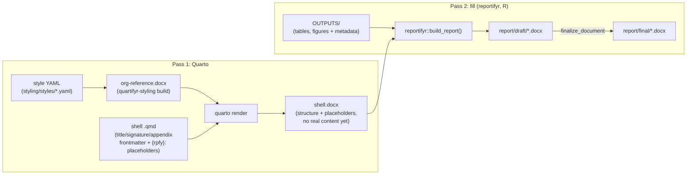

# Architecture: two passes



1. **Pass 1 (Quarto)** renders a styled, structurally-complete shell
   (`.docx`) from a `.qmd`: title page (dynamic per-project fields, plus
   a DRAFT/FINAL status stamp), contributor/approval signature pages,
   table of contents (including the title page), list of figures, list
   of tables, list of abbreviations (only ones actually used), numbered
   appendices, but no actual figures/tables yet, just `reportifyr`
   magic-string placeholders (`{rpfy}:filename.ext`).
2. **Pass 2 (fill)** fills that shell with real tables, figures, and
   footnotes from an `OUTPUTS/` directory, then optionally finalizes it.
   [`reportifyr`](https://github.com/A2-ai/reportifyr) is today's fill
   tool for reports, doing this exactly as it already does for
   hand-built shells.

These two passes are independent tools, not a monolith. `reportifyr`
doesn't know or care that a shell's `{rpfy}:` magic strings came from a
quartifyr render rather than a hand-built one; that's `reportifyr`'s own
mechanism, not a quartifyr invention. A plain `quarto render` alone
leaves the literal `{rpfy}:...` text visible in the output; that's
expected, not a bug, until pass 2 runs. `quarto render` in turn doesn't
know or care what happens to its docx afterward. [`r/`'s
`render_report()`](r-orchestration.html) is one convenience wrapper that
chains both passes together; it's optional. See [Using the pieces
directly](#using-the-pieces-directly) below.

## Using the pieces directly

You don't need `r/`'s orchestration driver, its `renv`-managed R
environment, or its `report/shell`/`report/draft`/`report/final`
directory convention to use quartifyr. If you already have your own
Quarto project and your own `reportifyr` project set up, the underlying
mechanics are three ordinary, independent tool calls:

```bash
# 1. Render the shell -- ordinary `quarto render`
quarto render report.qmd --to docx --reference-doc org-reference.docx \
  -M document-status:DRAFT

# 2. (Optional) header/footer + page-restart post-processing
quartifyr-styling apply-layout --docx report.docx --qmd report.qmd --status draft
```

```r
# 3. Fill it -- ordinary reportifyr, called exactly as you'd call it
# against a hand-built shell.
reportifyr::build_report(
  docx_in = "report.docx",
  docx_out = "report-filled.docx",
  figures_path = "OUTPUTS/figures",
  tables_path = "OUTPUTS/tables",
  standard_footnotes_yaml = "report/standard_footnotes.yaml",
  config_yaml = "report/config.yaml"
)
```

`render_report()` bundles these three calls into one because that's
convenient for a project starting from scratch: a convenience, not a
requirement. An existing reportifyr project's own layout and scripts
work unchanged; quartifyr only touches the docx that flows between steps
1 and 3.

## A few things worth knowing before you author a shell `.qmd`

**The `report/shell` → `report/draft`/`report/final` directory
convention is load-bearing for `render_report()`**, not just a naming
convention. `reportifyr::make_doc_dirs()` derives output paths by
substring-replacing "shell" in the rendered docx's *containing
directory*. A project's `_quarto.yml` must set `project:
{output-dir: report/shell}` for `render_report()` to find the right
output. Projects calling the three pieces directly instead aren't bound
by this.

**pStyle ID vs. display name: gets backwards easily, fails silently in
opposite directions.** If you're writing raw OOXML in a custom filter
(`<w:pStyle w:val="...">`), it must reference a style's **ID**
(`Heading1`, no space); Word/LibreOffice render the display-name form
fine visually via fallback, but Word's ToC field silently fails to
recognize such a paragraph as a heading. Conversely, pandoc's
`custom-style` Div attribute in `.qmd` bodies (used for a front-matter
section label like "Synopsis") matches by **display name** (`Heading 1`,
with the space); get this backwards and pandoc silently fabricates a
blank style with that literal name instead of erroring. See the [Quarto
extension](quarto-extension.html) page's "A pStyle gotcha" section for
the full detail if you're extending the filters yourself.

**Percentage-width tables, not fixed twips**: every table the extension
generates uses `w:type="pct"` so it spans the current usable text width,
so changing `page.margins_in` in a style YAML doesn't leave tables
overflowing or falling short.

## Status and known limitations

The core pipeline (styling, title/signature pages, ToC/LOF/LOT,
abbreviations, appendices, bibliography/citations, and the `reportifyr`
fill pass) is built and verified end to end (see
[`examples/demo-report/smoke_test.py`](https://github.com/jprybylski/quartifyr/blob/main/examples/demo-report/smoke_test.py),
which runs the real pipeline and checks the actual output on every run).
Two things are deliberately
incomplete rather than papered over:

- **Word field recalculation** (`quartifyr-styling recalculate-fields`,
  headless LibreOffice) is experimental: it works, but has shown
  non-deterministic failure modes in real testing. Off by default;
  without it, delivered docs need one manual "select all, F9" in Word to
  populate the ToC. See [Styling](styling.html) and [R
  orchestration](r-orchestration.html) for detail.
- **Figure/table numbering stays continuous through appendices** (e.g.
  "Figure 12" inside an appendix, not "Figure B-1"), a deliberate v1
  scope call, not a bug.
- **A citation's `link-citations: true` hyperlink can fail to navigate
  in Word** on documents where `reportifyr`'s own footnote-bookmark id
  happens to numerically collide with a citeproc bookmark id, a
  confirmed bug in `reportifyr`'s `remove_bookmarks()`, not something
  quartifyr's shell can prevent.

## vs. pharmtex

| | pharmtex (LaTeX) | quartifyr |
| --- | --- | --- |
| Toolchain | Full LaTeX distribution + custom packages | Quarto + R + Python, all mainstream, cross-platform installers |
| Org styling | LaTeX template files, org-specific macros | One YAML file per org |
| Failure mode | Obscure LaTeX compile errors, package resolution | Ordinary Quarto/R/Python errors with normal stack traces |
| Output format | PDF | `.docx`; reviewers use Word's own track-changes/comments |
| Learning curve | Steep (LaTeX syntax, package ecosystem) | A `.qmd` is Markdown + YAML frontmatter |
| Report fill | Custom | `reportifyr` today; pass-2 is a pluggable fill step, not fixed to it |
