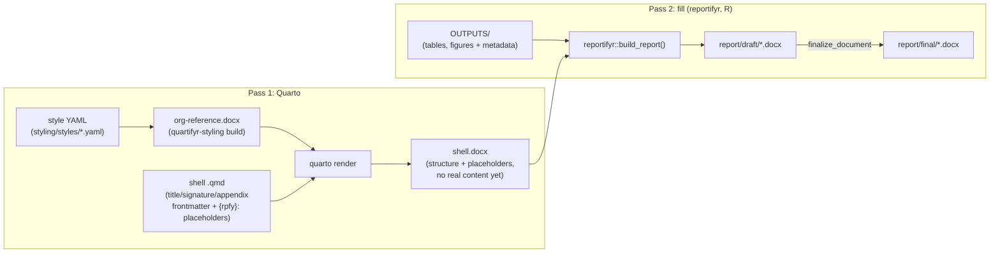

# quartifyr

A code-first system for generating standardized scientific/regulated
documents with [Quarto](https://quarto.org): an org's docx styling and a
document's title/signature/ToC/abbreviations front matter come from YAML
and a `.qmd`, not a hand-edited Word template.
{: .fs-6 .fw-300 }

[Get started](installation.html){: .btn .btn-primary .fs-5 .mb-4 .mb-md-0 .mr-2 }
[View on GitHub](https://github.com/jprybylski/quartifyr){: .btn .fs-5 .mb-4 .mb-md-0 }

---

## What quartifyr does

quartifyr only does **pass 1** of a two-pass pipeline: rendering a
styled, structurally-complete `.docx` "shell" (title page, signature
pages, ToC, synopsis, numbered appendices), but no real content yet, just
`{rpfy}:filename.ext` magic-string placeholders. A separate **pass 2**
fill tool ([`reportifyr`](https://github.com/A2-ai/reportifyr), external)
fills those placeholders with real tables/figures/footnotes. See
[Architecture](architecture.html) for the full picture.



## Why

Hand-built Word "shell" templates don't scale across projects or orgs:
every new study means someone re-clicking through Word's style pane, and
drift between shells is a matter of when, not if. The usual alternative,
pharmtex-style LaTeX pipelines, trades that problem for a steep learning
curve most scientific staff don't have, a toolchain that's
prone to breaking, and an output format (PDF) that's harder for
non-technical reviewers to comment on directly than the Word documents
they already know.

quartifyr's answer: generate everything (the org's docx styling, the
shell's title/signature/ToC/abbreviations front matter, appendix
numbering) from code and YAML, output real `.docx` all the way through,
then hand the shell to a fill tool to do what it already does well:
filling it with real tables, figures, and footnotes. No LaTeX. No manual
Word template surgery. A new org's look is a YAML diff; a new project is
a `.qmd` with the right frontmatter, not a Word template someone
hand-builds from scratch.

## Three independently-usable components

| Component | What it is |
| --- | --- |
| [Quarto extension](quarto-extension.html) | `_extensions/quartifyr/`: title page, signature pages, synopsis, numbered appendices, page header/footer |
| [`styling/`](styling.html) | Turns a style YAML into a docx `reference-doc`; abbreviations bridge; headless field recalculation |
| [`r/`](r-orchestration.html) | `render_report()` orchestration driver chaining Quarto render → `apply-layout` → `reportifyr::build_report()` |

## Quick start

Want to see the shell before installing anything but Quarto? A committed
`templates/org-reference.docx` means this alone renders a real, styled
shell (title page, signature pages, synopsis) with `{rpfy}:`
placeholders still literal (pass 2 hasn't run):

```bash
git clone https://github.com/jprybylski/quartifyr.git
cd quartifyr/examples/demo-report
quarto render report.qmd --to docx --reference-doc ../../templates/org-reference.docx \
  -M document-status:DRAFT
```

See [Installation](installation.html) for the full toolchain (Quarto +
`styling/` venv + `r/`) needed to run the complete two-pass pipeline, and
[Examples](examples.html) to see real rendered output from both bundled
example projects.
